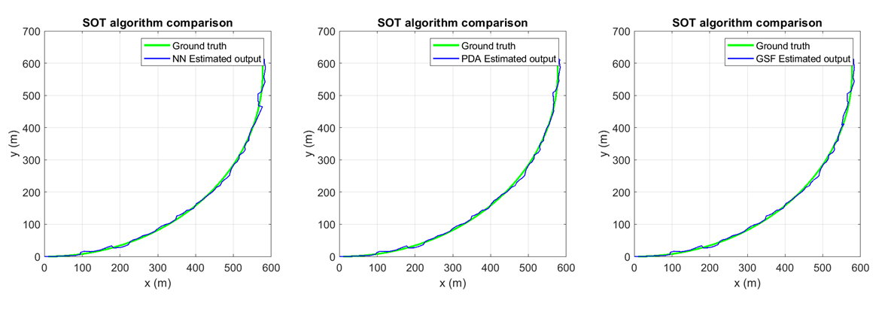
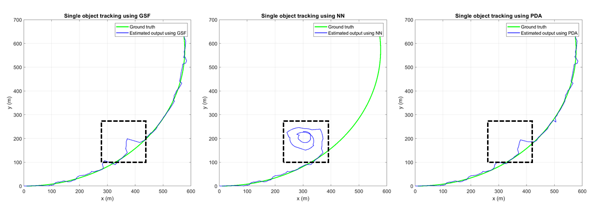

## Module2

### Single object tracking in clutter
1. Inclusion of object detection probability(P_D) in hypothesis
2. Standard Clutter models
3. Bernoulli, Binomial and Poission distribution and their usecases
4. Exact Motion and measurement models for SOT in clutter
5. Cons of actual model and ways to approximate solution
6. NN  - Algorithm, pros and cons
7. PDA - Algorithm, pros and cons
8. GSF - Algorithm, pros and cons
9. Practical approach - Gating, pruning and merging methods

### PDA concepts
- Equivalent to JPDA with always 1 object to track
- Single hypothesis posterior density 
- Posterior is like weighted sum of different hypotheses
- Hypotheses are merged to match 1st two moments
- Since every Hypothesis is used to calculate posterior, the resulting 
  variance is higher compared to NN and GSF
- ***Need to appreciate the method of deriving a scalar value that reprsents
  probability of the hypothesis. Its trivial in SOT scenarios but is more 
  involved with multiple objects***

### Simulation setup

1. Objective is to track a single object using measurements from sensor readings.

2. Coordinated turn motion model (object assumed to undergo constant angular 
   velocity motion)

3. Bearing - range measurement model (~ radar sensor readings)

4. Constant Detection probability (P_D) and clutter rate intensity within the
   sensor field of view
 

The NN, PDA and GSF algorithms are compared in scenarios of varying tracking difficulty 
using the above motion and measurement models.

### Comparison results

#### Simple Scenario with High P_D and Low clutter

In simple scenarios with higher probability of detection and less clutter rate,
there is little difference between the three algorithms in terms of tracking 
accuracy. 

#### More difficult Scenario with Low P_D and High clutter

In scenarios where the Nearest Neighbour algorithm assumes clutter as possible
measurement and loses track, it is very difficult for the algorithm to converge
again. Highlighted in the results below.
 

