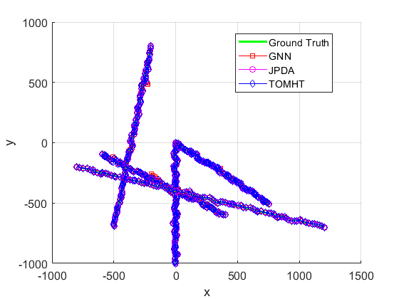
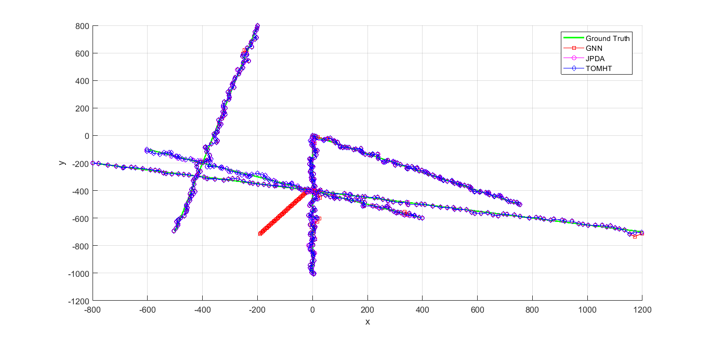
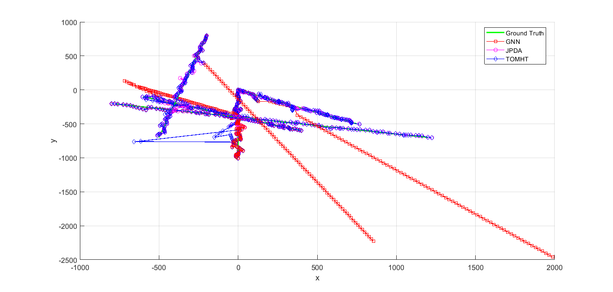

## Module3

### n-Object object tracking in clutter
1. Tracking fixed number of objects 
2. Prediction step is similar with independent object motion assumption
3. Exact Motion and measurement models for SOT in clutter
4. Cons of actual model and ways to approximate solution
5. GNN  - Algorithm, pros and cons
7. JPDA - Algorithm, pros and cons
7. MHT  - Algorithm, its variants, pros and cons

### JPDA concepts
- Idea of PDA extended to multiple objects
- Single hypothesis posterior density 
- Posterior is like weighted sum of different hypotheses
- Hypotheses are merged to match 1st two moments
- Since every Hypothesis is used to calculate posterior, the resulting 
  variance is higher compared to GNN and MHT filters
- The smart part is to derive a a scalar value that represents
  probability of the hypothesis (n-object association). The value
  must be calculated jointly for all objects for a given hypothesis
- The idea is to compute joint association probabilities of the individual 
  marginal probabilities (see JPDA basic idea, marginal association probabilities
  section in handout)
  
## N-Object Tracking Results

#### Simple Scenario with High P_D and Low clutter

In simple scenarios with higher probability of detection and less clutter rate,
there is little difference between the three algorithms in terms of tracking 
accuracy. 

#### GNN failure case

Even in simple scenarios, there can be cases where GNN can lose track. This is 
due to the fact that the best hypothesis calculated for the timestep might not
be optimal over the entire timeline. So, if the optimal association is lost, then
the GNN cannot track the object effecitvely

In complex scenarios (i.e when P_D is lower and clutter intensity is high), GNN 
will mostly lose track of the object while JPDA and TO-MHT still perform effectively

