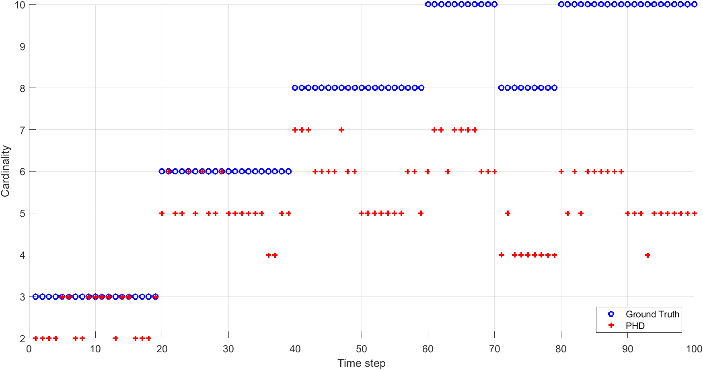
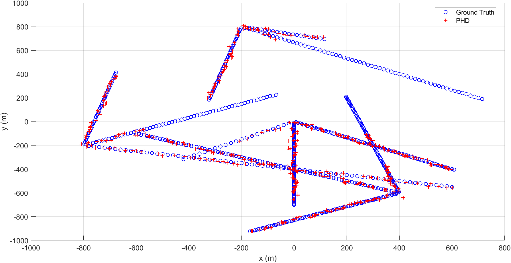
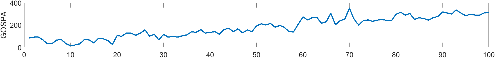

## Module4 Random Finite Sets (RFS)
- Sets are collection of unique elements that are invariant to order of elements
- Cardinality of a set = Number of elements in a set
- RFS = Sets with finite but random number of elements with random element states
- Properties of sets very suitable for MOT modelling - invariant to order, no duplicate elements
- Distribution of Sets can be described by its MO-PDF (Multi object PDF)
- Convolution formula to find distribution of union of multiple sets 
- Bernoulli RFS, Poisson Point Process are RFS used commonly in MOT

### Bernoulli RFS

### Poisson Point Process

### PHD of RFS

### PHD filter concept

### GM-PHD filter

### GM-PHD simulation results

In case of RFS, the outputs are not ordered. So, its not trivial to calculate RMSE as with
matrices. The solution is to find the best possible association between the ground truth and
the filter output and calculate tracking error between them. Such metrics account for localisation
error (RMSE component) while penalising missed and false detected objects. 

Hence PHD results contain plots for cardinality error and localisation error.

GOSPA is a scalar representing weighted average of cardinality and localisation errors

